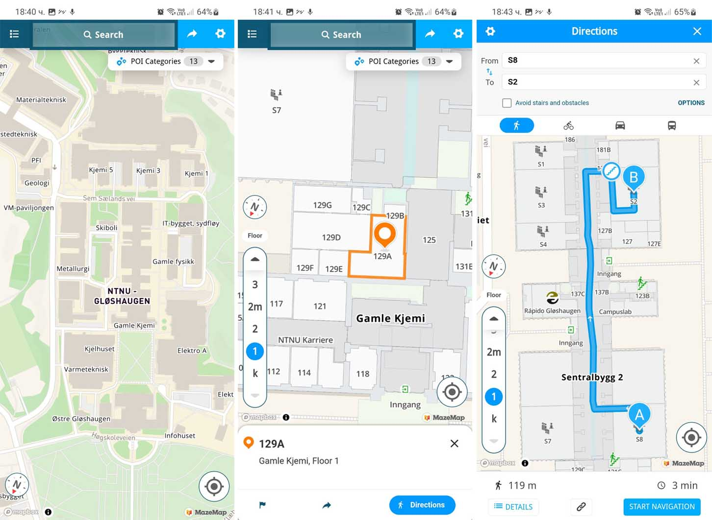
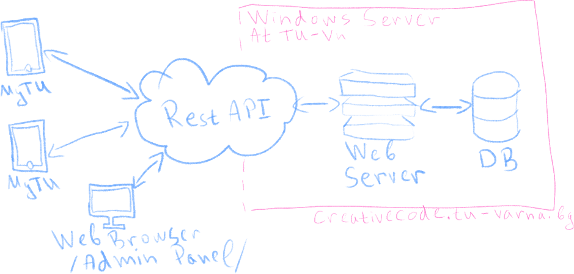
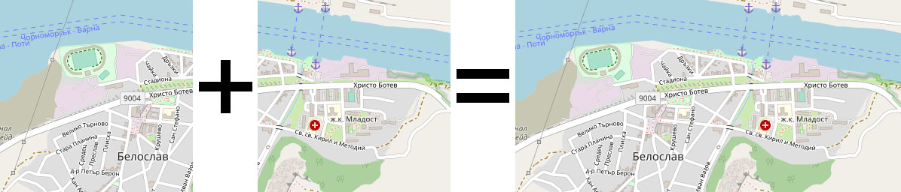
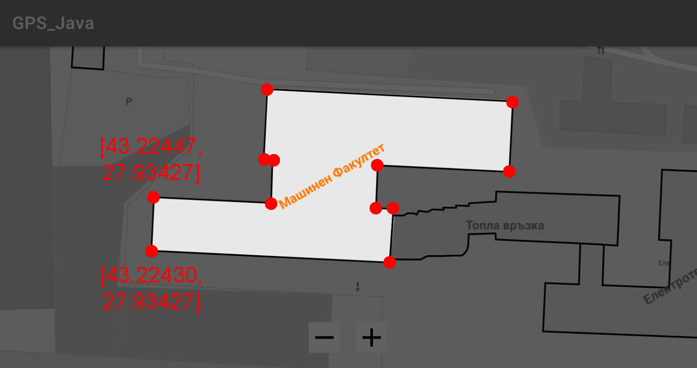

<!-- PROJECT LOGO -->  
   

  
    
  
<h3 align="center">Изграждане на система и приложение за позициониране и навигиране в ТУ - Варна</h3>  
  
  
  
    Bachelor thesis, 2023, TU Varna  
       
    <a href="https://github.com/tsvetelinpetrov/bachelor_thesis/issues">Report Bug</a>  
    ·  
    <a href="https://github.com/tsvetelinpetrov/bachelor_thesis/issues">Request Feature</a>  
  
 

 
  
<!-- TABLE OF CONTENTS -->  

  
  
Съдържание
  
  <ol>  
    <li><a href="#за-проекта">За проекта</a></li>  
    <li><a href="#roadmap">Roadmap</a></li>  
  </ol>  

  
  
  
## Задание
Целта на дипломната работа по темата “Изграждане на система и приложение за позициониране и навигиране в ТУ - Варна” е да се изгради система от модули, обединени в едно мобилно приложение “MyTU”, чието предназначение е да бъде в полза на студенти, преподаватели, персонал, гости и посетители на Технически университет - Варна. Приложението ще предоставя набор от функционалности, както следва:
 1. Изглед на картата на територията на Технически университет - Варна;
 2. Преглед на сградите на университета;
 3. Преглед на помещенията, залите и лабораториите в сградите като обекти върху картата;
 4. Преглед на подробна информация за всеки обект;
 5. Преглед на учебните разписи на студенти и преподаватели.

### Функционални изисквания
Мобилно приложение трябва да дава възможност на потребителите да получават достъп до информация за всички сгради, помещения зали и др. (наричани накратко ОБЕКТИ), намиращи се на територията на университета. При визуализиране, обектите трябва да изграждат дигитална карта на университета. В изгледа на картата трябва да се предостави функционалност за Zoom In и Zoom Out, чрез която потребителя да може да регулира големината на обектите спрямо своите нужди.
В дигиталната карта всеки етаж на сградите се показва като отделен слой. Да се осигури възможност за избор и промяна на етажа, който да се визуализира. Изобразяването на помещенията е нужно да се извършва при подходящо ниво на Zoom.
За всеки обект е нужно да се визуализира съответстващ за него надпис с подходящи цвят, големина и ротация.
Трябва да се предвиди възможност за динамично редактиране и допълване на данните за обектите от администратор на системата.
Потребителите да имат възможност да получават упътвания (да бъдат навигирани) до желан от тях обект.

(<a href="#top">нагоре</a>)
  

## Фаза на проучване
### Съществуващи системи
#### <a href="https://www.mazemap.com" target="BLANK">  MazeMap</a>
  

### Спецификации
За осъществяване на обособените функционалности е необходимо да се изгради система, базирана на архитектурата клиент-сървър.
  

### RESTful API

 - ASP.NET Core;
 - EntityFramework;
 - MySQL.

### Mobile app

 - Java (Android Studio);
 - OSMDROID и GeographicLib за работа с карти и географски данни;
 - Retrofit за извършване на заявки към сървърното приложение.

#### Карта
За визуализиране на картата ще се използва OSMDroid. Нналичния в библиотеката клас MapViw предоставя богата гама от възможности за лесна работа с координатна система и географски точки.
Картата ще се изгражда от няколко слоя:

 - Първи слой ще репрезентира землището на кампуса (двор, пътеки, паркинги, дървета, тревни площи и т.н). За целта ще се използват предварително генерирани изображения/снимки с размер 256px X 256px, наречени плочки (tiles). Всяка плочка ще се съхранява на уеб сървъра, където ще бъде достъпна за приложението. При rendering процеса на картата ще се изтеглят всички необходими плочки и ще се поставят една до друга, за да се получи цялостен изглед на картата (този процес е имплементиран в класа MapView на OSMDroid).
   
Към момента са извлечени всички необходими плочки от уеб сървъра с картографските изображения на Open Street Map, които са нужни за визуализация на землището на университета и околността. Изображенията са качени на сървъра в университета (http://creativecode.tu-varna.bg/mapsource/). На по-късен етап плочките ще бъдат модифицирани от дизайнери, като ще се направи по-модерно и по-точно изобразяване на детайлите в двора на университета.

- Вторият слой ще репрезентира всички сгради в кампуса. Той ще се насложи върху първия и ще се рисува в реално време при отваряне на картата. Необходимите данни за изобразяването на всяка сграда ще се извличат от DB чрез API-я. За изчертаването на сградите е необходим последователен набор от географски координати/точки. Всяка точка се поставя върху картата, след което чрез подходяща библиотека съседните точки се свързват с линия. След свързване на всички линии се получава polygon.

  

(<a href="#top">нагоре</a>)
  
  
  
## Roadmap  
- [ ] - - -
- [ ] - - -
  

(<a href="#top">нагоре</a>)
  

