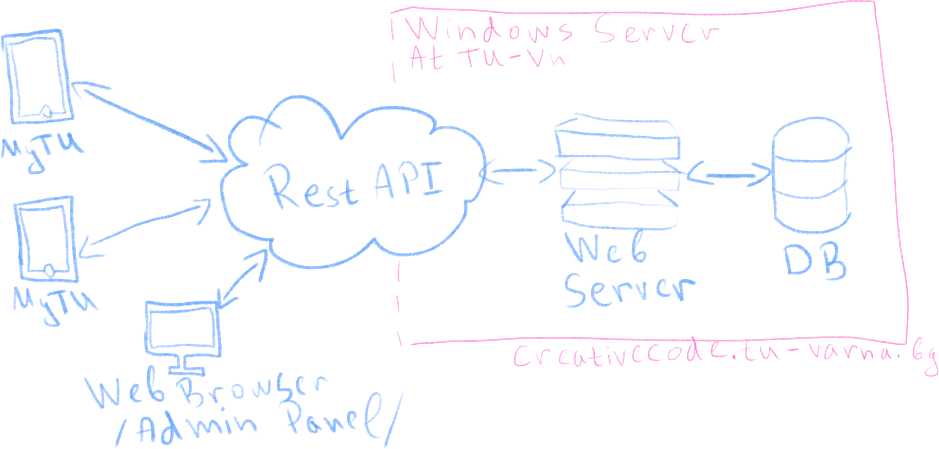
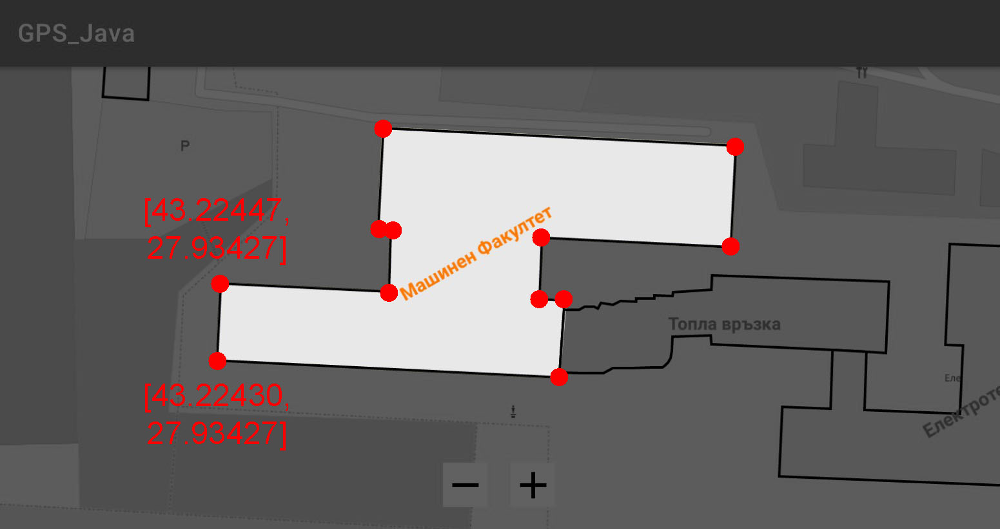
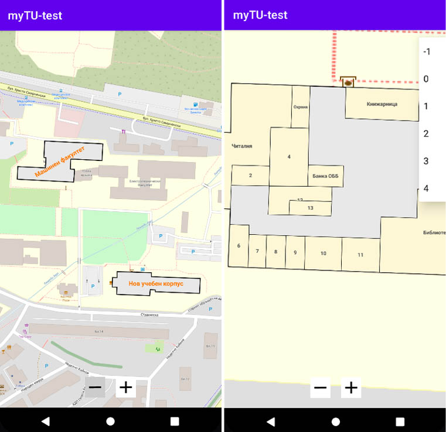
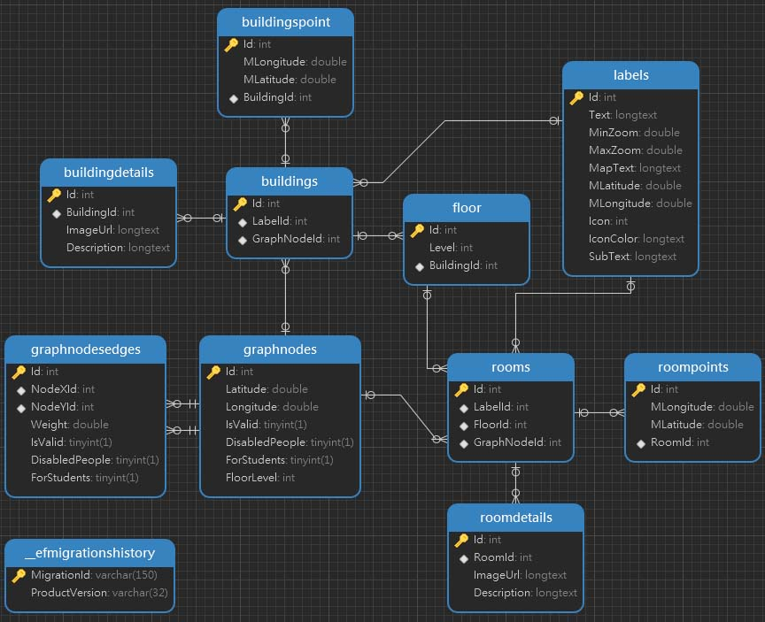

<!-- PROJECT LOGO -->
 

  

<h3 align="center">Building a System and Application for Positioning and Navigation at TU - Varna</h3>

  

    Bachelor thesis, 2023, TU Varna
     
    Tsvetelin Petrov
     
    <a href="https://github.com/tsvetelinpetrov/bachelor_thesis/issues">Report Bug</a>
    ·
    <a href="https://github.com/tsvetelinpetrov/bachelor_thesis/issues">Request Feature</a>
  

<!-- Bulgarian version link -->

    <a href="README_BG.md">Bulgarian version of the document</a>

<!-- TABLE OF CONTENTS -->

  
Contents

  <ol>
    <li><a href="#task">Task</a></li>
    <li><a href="#FunctionalRequirements">Functional Requirements</a></li>
  </ol>

## Task
The aim of the bachelor thesis on the topic "Building a System and Application for Positioning and Navigation at TU - Varna" is to build a system of modules unified into a mobile application "MyTU," intended to benefit students, professors, staff, guests, and visitors of Technical University - Varna. The application will provide a set of functionalities as follows:
 1. View of the map of the territory of Technical University - Varna;
 2. Viewing of the university buildings;
 3. Viewing of the premises, halls, and laboratories in the buildings as objects on the map;
 4. Detailed information view for each object;
 5. Viewing of the class schedules of students and professors.

### Functional Requirements
The mobile application should provide users with access to information about all buildings, rooms, halls, etc. (referred to as OBJECTS) located on the university campus. When visualizing, the objects should build a digital map of the university. The map view should provide Zoom In and Zoom Out functionality, allowing the user to adjust the size of the objects according to their needs.
In the digital map, each floor of the buildings is displayed as a separate layer. The ability to select and change the floor to be visualized should be provided. The visualization of the rooms should be performed at an appropriate Zoom level.
For each object, a corresponding label with suitable color, size, and rotation should be displayed.
Dynamic editing and supplementing of the object data by the system administrator should be provided.
Users should have the ability to receive directions (to be navigated) to their desired object.

(<a href="#top">back to top</a>)

## Investigation Phase
### Existing Systems
#### <a href="https://www.mazemap.com" target="BLANK">MazeMap</a>

## Design Phase
### Specifications
To implement the specified functionalities, it is necessary to build a system based on the client-server architecture.

### RESTful API

 - ASP.NET Core;
 - EntityFramework;
 - MySQL.

### Mobile app

 - Java (Android Studio);
 - OSMDROID and GeographicLib for working with maps and geographic data;
 - Retrofit for making requests to the server application.

#### Map
OSMDroid will be used for map visualization. The MapView class available in the library provides a rich set of features for easy work with coordinate systems and geographic points.
The map will be composed of several layers:

 - The first layer will represent the terrain of the campus (courtyards, paths, parking lots, trees, grassy areas, etc.). Pre-generated images/photos with a size of 256px X 256px, called tiles, will be used for this purpose. Each tile will be stored on the web server, where it will be accessible to the application. During rendering, all necessary tiles will be downloaded and placed next to each other to obtain a complete view of the map (this process is implemented in the MapView class of OSMDroid).
   
At the moment, all necessary tiles with cartographic images from Open Street Map have been extracted, which are necessary for the visualization of the university campus and its surroundings. The images are uploaded to the university's server (http://creativecode.tu-varna.bg/mapsource/). Later, the tiles will be modified by designers to provide a more modern and accurate depiction of the details in the university courtyard.

- The second layer will represent all buildings on campus. It will be superimposed on the first layer and will be drawn in real-time when opening the map. The necessary data for drawing each building will be extracted from the database via the API. Drawing the buildings requires a sequential set of geographic coordinates/points. Each point is placed on the map, after which adjacent points are connected by lines using a suitable library. After connecting all lines, a polygon is obtained.

- The third layer will display all rooms in the buildings based on the specified floor/level. This layer will be overlaid directly on the second layer only at a certain Zoom level (When the map is too zoomed out, the rooms are hidden). Drawing the rooms in this layer is similar to drawing the buildings in layer 2.

Each polygon from layers 2 and 3 will provide interaction. Upon single tap, a popup with name, brief description, and navigation button to the object will be displayed. Upon Swipe up on the popup, it will slide up and occupy a larger portion of the screen, providing more information about the object, such as the type of room, operating hours (if administrative unit), class schedule (if laboratory or lecture hall).

The data for layers 2 and 3 will be stored and retrieved from the database.

For navigation within the application, a graph will be constructed from point to point, searching for the shortest path by implementing the Dijkstra's algorithm. A vertex in the graph is created for each key point (door to room/hall, turn, end of corridor, entrance to a building, etc.). The vertices are connected by edges. Three flags are implemented for each vertex and edge:
- Flag for prohibiting the use of the vertex/edge when determining the path entirely;
- Flag for prohibiting the use of the vertex/edge when determining the path for wheelchairs and people with mobility difficulties;
- Flag for prohibiting the use of the vertex/edge when determining the path for students.

Updating the user's current location will be done by scanning a QR code or reading an NFC tag. The codes and tags will be placed at key points corresponding to the path-finding graph.

### DB Model

### Wireframe

### Prototype

! Wireframes and prototype images are from the initial planning. The final product may not look exactly like this.

  

(<a href="#top">back to top</a>)
  

### Product Demo

  

(<a href="#top">back to top</a>)

